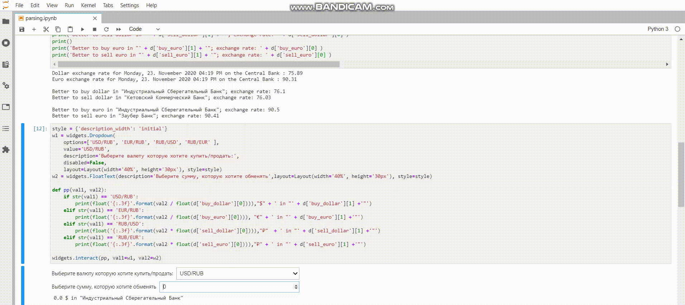

# Выгодные курсы обмена валюты в Санкт-Петербурге

## V 1.0 Application
App-converter

### Getting started

Make sure you have [pip installed](https://pip.readthedocs.org/en/stable/installing/) and run:

```bash
pip install PyQT5
pip install pyqt5-tools
pip install requests
pip install bs4
pip install ipywidgets
```

### Run converter.py

Choose USD/EUR/RUB and amount to convert into USD/EUR/RUB  

Then, if you want to know where to exchange currency press the coin image

### Running

example:

it should be a video (later)


## V 0.0  Using JupyterLab
The program gives (at the time of launch) the current exchange rate of the dollar and euro against the ruble at the Central Bank.

You can see a favorable exchange rate in St. Petersburg.

(It has a built-in currency converter)

### Getting started

Make sure you have [pip installed](https://pip.readthedocs.org/en/stable/installing/) and run:

```bash
pip install requests
pip install bs4
pip install ipywidgets
```
### Running

example:


